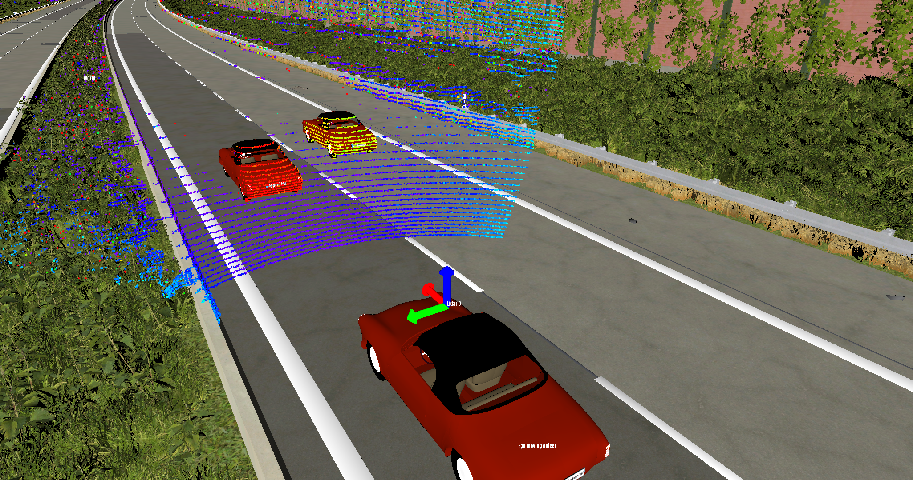
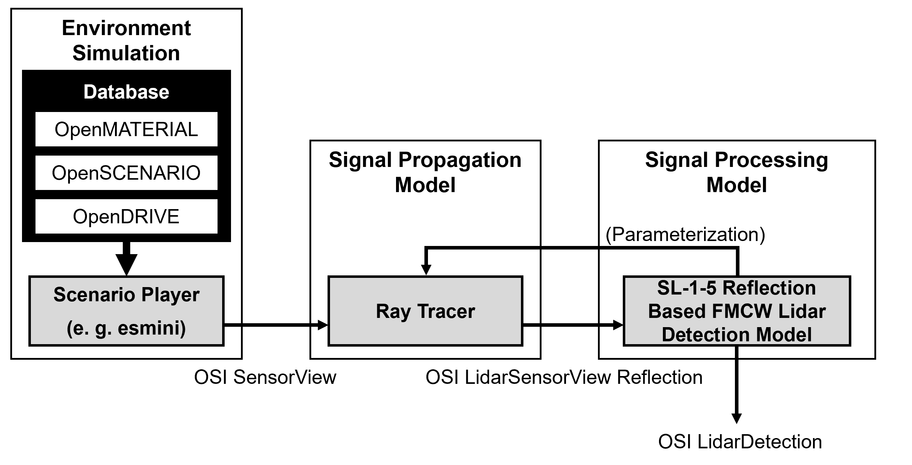

# SL-1-5 Reflection Based FMCW Lidar Detection Model [](https://github.com/openMSL/sl-1-5-reflection-based-fmcw-lidar-detection-model/actions/workflows/credibility_assessment.yml)

[](https://github.com/openMSL/sl-1-0-sensor-model-repository-template/actions/workflows/credibility_assessment.yml)

This is a parameterizable reflection based FMCW lidar detection model that uses the Open Simulation Interface (OSI) standard.
The model receives lidar reflection data calculated in a simulation tool beforehand e.g. with ray tracing and outputs lidar detection data.
In contrast to [SL 1-2 Reflection Based Lidar Object Model](https://github.com/openMSL/sl-1-2-reflection-based-lidar-object-model), an additional radial velocity component is processed for each detection in order to model the FMCW principle.

<br><br>



The visualization of the model output was created with the [Simspector](https://www.persival.de/simspector) developed by Persival GmbH.

## Modeling Approach

### Simulation Architecture

The model in this repository is the signal processing model of a FMCW lidar sensor simulation.
The simulation architecture ist depicted in the figure below an consists of the enviroment simulation, the signal propagation model and the signal processing model.
[Open Simulation Interface (OSI)](https://github.com/OpenSimulationInterface/open-simulation-interface) is used for communication between the components.
For the environmental simulation and the signal propagation model, any model can be used if the corresponding OSI interfaces are supported as specified below.
The signal processing model presented here is based on the [sl-1-0-sensor-model-repository-template](https://github.com/openMSL/sl-1-0-sensor-model-repository-template).



Architecture of the sensor simulation based on [[1](#Hofrichter2024)</sup>].

### Signal Processing [[1](#Hofrichter2024)</sup>]

The input for the model are lidar reflections (`sensor_view.lidar_sensor_view.reflection`), which can be calculated using a ray tracer, for example.
Each reflection holds the information a, b and c. In addition, a predefined beam pattern determines from which direction, depending on the azimuth and elevation angle, the reflections originate.
For the modeling approach, the beam pattern is divided into discrete areas, called pixels, from which a lidar detection can result.
The beam pattern is assumed to consist of horizontal scan lines that are stacked on top of each other.
Accordingly, the size of the individual pixels is determined by the vertical beam divergence of the laser and the azimuth resolution of the sensor.
The pixels are super-sampled by multiple reflections as described in [[2](#Rosenberger2020)</sup>].
For each pixel, an up-ramp and a down-ramp Fast Fourier Transform (FFT) is calculated according to the FMCW principle to determine the distance and velocity of the lidar detection.
The FFTs are approximated using the Fourier tracing method [[3](#Holder2019)</sup>], which was also used in the [sl-1-1-reflection-based-radar-object-model](https://github.com/openMSL/sl-1-1-reflection-based-radar-object-model).
A simple maximum function is used to detect a peak in the up and down-ramp spectrum, from which the distance and velocity of the detection are derived.
This procedure is repeated for each pixel, resulting in a point cloud as output.

## Parameterization

### Beam Pattern

| Parameter                           | Description                                                      |
|-------------------------------------|------------------------------------------------------------------|
| `no_of_layers`                      | Number of horizontal scan lines                                  |
| `beam_center_elevation_deg`         | Elevation angle for each horizontal scan line in deg             |
| `min_azimuth_rad`                   | Minimum azimuth angle in rad                                     |
| `max_azimuth_rad`                   | Maximum azimuth angle in rad                                     |
| `azimuth_resolution_rad`            | Azimuth resolution of beam pattern in rad                        |
| `beam_divergence.vertical_angle`    | Vertical beam divergence in rad                                  |
| `beam_divergence.horizontal_angle`  | Horizontal beam divergence in rad                                |
| `emitted_power_per_beam_mW`         | Emitted power per beam in mW                                     |

### Ray Pattern

| Parameter                           | Description                                                                  |
|-------------------------------------|------------------------------------------------------------------------------|
| `rays_per_beam_horizontal`          | Number of rays per beam in horizontal direction                              |
| `rays_per_beam_vertical`            | Number of rays per beam in vertical direction                                |
| `distance_noise_std`                | Standard deviation of distance noise applied to each ray in m                |
| `rays_per_beam_vertical`            | Standard deviation of velocity noise applied to each ray in m/s              |

### Lidar Parameters

| Parameter                           | Description                                                                  |
|-------------------------------------|------------------------------------------------------------------------------|
| `wavelength_m`                      | Wavelength of emitter in m                                                   |
| `min_range`                         | Minimum range in m                                                           |
| `max_range`                         | Maximum range in m                                                           |
| `ramp_duration`                     | Duration of up/down ramp in triangular frequency modulation pattern in s     |

### Fourier Tracing Parameters

| Parameter                           | Description                                                                  |
|-------------------------------------|------------------------------------------------------------------------------|
| `window_data_per_bin`               | Data points per bin in the look-up table                                     |
| `bin_affect_range`                  | Number of bins that are effected by the windowing function                   |
| `window_function`                   | Window function lookup-table                                                 |
| `fft_size`                          | Size of FFT                                                                  |

**Note:** Due to issues with OpenMCX, the ray configuration has to be set within the ray tracing model as well.

## Interface

### Input: Required Fields in OSI3::SensorView

| OSI Message                                                          | Required / Optional |
|----------------------------------------------------------------------|---------------------|
| `sensor_view.lidar_sensor_view.view_configuration.mounting_position` | required            |
| `sensor_view.lidar_sensor_view.reflection.signal_strength`           | required            |
| `sensor_view.lidar_sensor_view.reflection.time_of_flight`            | required            |
| `sensor_view.lidar_sensor_view.reflection.doppler_shift`             | required            |

### Output: Fields in OSI3::SensorData Filled by the Sensor Model

| OSI Message                                                       | Required / Optional |
|-------------------------------------------------------------------|---------------------|
| `sensor_data.timestamp`                                           | required            |
| `sensor_data.feature_data.lidar_sensor.header.mounting_position`  | required            |
| `sensor_data.feature_data.lidar_sensor.header.sensor_id`          | required            |
| `sensor_data.feature_data.lidar_sensor.detection.position`        | required            |
| `sensor_data.feature_data.lidar_sensor.detection.intensity`       | required            |
| `sensor_data.feature_data.lidar_sensor.detection.radial_velocity` | required            |

## Build Instructions

### Build Model in Ubuntu 18.04 / 20.04

1. Clone this repository **with submodules**:

    ```bash
    git clone https://github.com/openMSL/sl-1-5-reflection-based-fmcw-lidar-detection-model.git --recurse-submodules
    ```

2. Build the model by executing in the extracted project root directory:

    ```bash
    mkdir cmake-build
    cd cmake-build
    # If FMU_INSTALL_DIR is not set, CMAKE_BINARY_DIR is used
    cmake -DCMAKE_BUILD_TYPE=Release -DFMU_INSTALL_DIR:PATH=/tmp ..
    make
    ```

3. Take FMU from `FMU_INSTALL_DIR`

## Credits

K. Hofrichter, C. Linnhoff, L. Elster, S. Peters, [*“FMCW Lidar Simulation with Ray Tracing and Standardized Interfaces,”*](https://www.sae.org/publications/technical-papers/content/2024-01-2977/) 2024 Stuttgart International Symposium, Stuttgart, Germany, 02-03 July 2024

This work received funding from the research project "[Synthetic FMCW-Lidar](https://www.fzd.tu-darmstadt.de/forschung/research_projects_fzd/synthetic_fmcw_lidar/standardseite_265.en.jsp)"
which is financed with funds of LOEWE - Landes-Offensive zur Entwicklung Wissenschaftlich-ökonomischer Exzellenz, Förderlinie 3: KMU-Verbundvorhaben (State Offensive for the Development of Scientific and Economic Excellence).

| Synthetic FMCW-Lidar                                                                                     | LOEWE-Förderlinie 3                                                                                                  | Hessisches Ministerium für Wissenschaft und Kunst                                                                                                                                                                                 |
|----------------------------------------------------------------------------------------------------------|----------------------------------------------------------------------------------------------------------------------|--------------------------------------------------------------------------------------------------------------------------------------------------------------------------------------|
|  |  |  |

Thanks to all contributors of the following libraries:

- [Open Simulation Interface](https://github.com/OpenSimulationInterface/open-simulation-interface), a generic interface based on protocol buffers for the environmental perception of automated driving functions in virtual scenarios
- [FMI Version 2.0: FMI for Model Exchange and Co-Simulation](https://fmi-standard.org/downloads/)

## References

<a name="Hofrichter2024">[1]</a>
K. Hofrichter, C. Linnhoff, L. Elster, S. Peters, “FMCW Lidar Simulation with Ray Tracing and Standardized Interfaces,” 2024 Stuttgart International Symposium, Stuttgart, Germany, 02-03 July 2024.

<a name="Rosenberger2020">[2]</a>
P. Rosenberger, M. F. Holder, N. Cianciaruso, P. Aust, J. F. Tamm-Morschel, C. Linnhoff, and H. Winner,
“Sequential lidar sensor system simulation: A modular approach for simulation-based safety validation of automated driving,”
Automotive and Engine Technology, vol. 5, no. 3-4, pp. 187–197, Dec. 2020.

<a name="Holder2019">[3]</a>
M. F. Holder, C. Linnhoff, P. Rosenberger, and H. Winner, [*“The Fourier Tracing Approach for Modeling Automotive Radar Sensors,”*](https://ieeexplore.ieee.org/document/8768113) 20th International Radar Symposium (IRS), Ulm, Germany, 26-28 June 2019.

